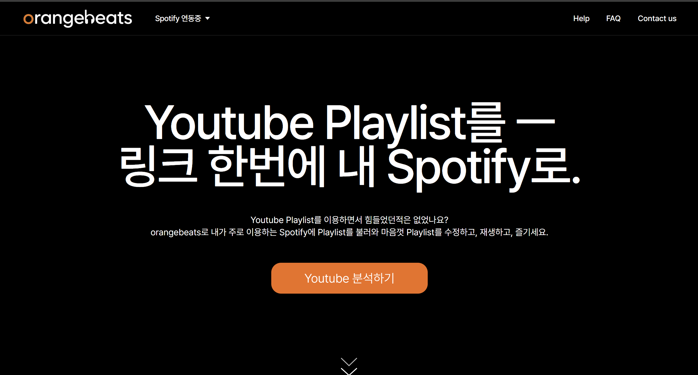
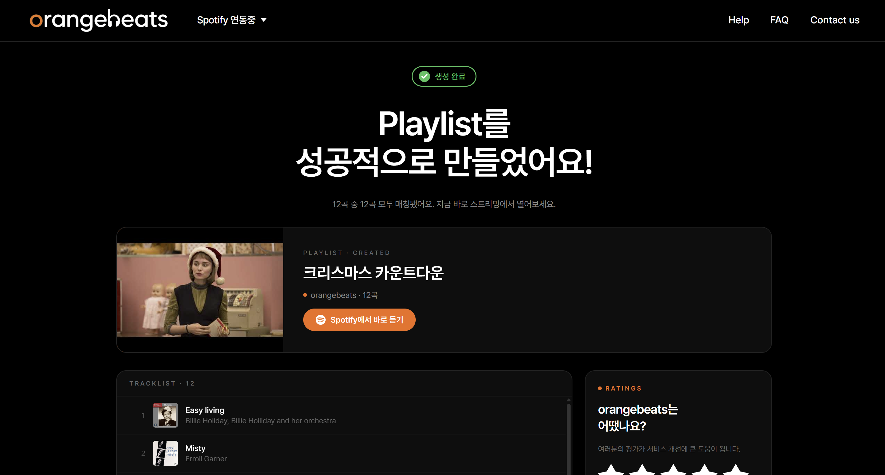
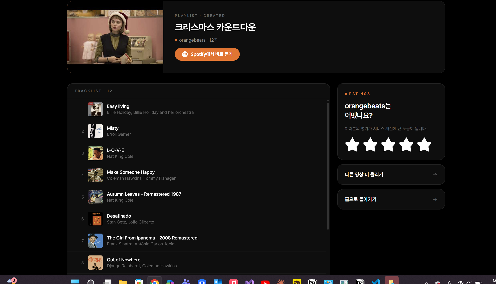

# 🎵 OrangeBeats

> YouTube 믹스/플레이리스트 영상의 비정형 텍스트를 LLM으로 분석해 Spotify 플레이리스트로 자동 변환하는 웹 서비스



<table>
  <tr>
    <td></td>
    <td></td>
  </tr>
</table>

단순 텍스트 추출을 넘어, **텍스트 → OCR → ACR**로 이어지는 3단계 Fallback 구조로 정보가 부족한 영상에서도 곡 정보를 추출하고, Spotify 매칭·플레이리스트 생성까지 연결한다.

---

## 핵심 기능

### YouTube 입력 해석
- `watch?v=...` / `watch?v=...&list=RD...` / `playlist?list=...` / `youtu.be/...` 분기 처리
- 영상/플레이리스트 자동 판별 및 `video_id` 추출
- 잘못된 입력 형식은 400 에러로 반환

### 데이터 수집
- YouTube Data API `playlistItems`, `commentThreads` 호출
- 설명란 + 댓글 + 음악 섹션(곡 제목/아티스트/앨범) 수집
- 댓글 정책: 기본 30개, 최대 50개
- 댓글 비활성화(403/404) 영상은 스킵 처리

### 3단계 Fallback 분석 구조

```
Text Parsing  →  Vision OCR  →  ACRCloud
  (저비용·고속)     (화면 분석)   (오디오 지문)
```

1. **Text Parsing** — 설명란·댓글 기반 1차 분석 (대부분의 영상 처리)
2. **Vision OCR** — Fallback 필요 시 40초 간격 프레임 샘플링 후 화면 텍스트 인식
3. **ACRCloud** — 텍스트·화면 모두 부족 시 최대 40개 오디오 세그먼트 병렬 음원 식별

**Fallback 진입 조건** (다음 중 하나):
- 추출된 곡 수 < 3개
- artist + title 모두 있는 완전한 곡 < 2개
- 완전한 곡의 비율 < 70% 또는 평균 완성도 < 60%

**Fallback 경로 선택**:
- 화면에 타임스탬프·트랙리스트 구조 신호 감지 → OCR 우선 권장
- 텍스트가 짧거나 노이즈만 있는 경우 → ACR 우선 권장

### LLM 추출 + 규칙 기반 검증

텍스트 분석은 입력 신호 강도에 따라 두 가지 경로로 분기:

- **Rule Fast Path** (타임스탬프 2개 이상, 3줄 블록 형식, 강한 구분자 신호 등): Rule Parser 우선 실행 → 실패 시 LLM Fallback
- **Mixed Path** (신호 약함): LLM과 Rule Parser 병렬 실행 → LLM 성공 시 우선 채택, 실패 시 Rule 결과 사용

LLM은 **후보 추출 역할로 제한**, parser·rule-based logic이 검증·정제·성공 판단 담당
- artist/title swap 방지: 영상 전체 곡 목록의 패턴을 먼저 파악하는 **global direction 로직** + rule 투표 + swap_guard
- 환각 통제: "추측 금지" 프롬프트 + JSON 출력 제약 + NON_MUSIC 필터 (URL, 이메일, 소셜 핸들, 이미지 출처, 섹션 키워드 제외)

### YouTube 음악 섹션(Content ID) 통합

텍스트 분석과 별도로 YouTube Content ID 데이터를 수집해 결과를 보강:
- 아티스트 정보 누락 곡 → Content ID 메타데이터로 자동 보완
- 텍스트에서 미추출된 곡 → Content ID에서 자동 추가
- 텍스트 추출 완전 실패 시 → Content ID가 최후의 폴백 소스로 동작

### 파싱 모듈화
- 비정형 텍스트 → JSON 파싱 유틸 분리
- 타임스탬프 패턴(`00:00`, `1:23`) + `Song - Artist` 패턴 처리
- 번호 목록, 한·영 혼합 표기, 괄호 포함 제목, 번역 제목 처리 범위 확장
- JSON 응답 정규화 / 중복 제거
- 성공 판단: `artist_exists`, `title_exists`, `is_complete`, `completeness_score` 기반 구조 검증

### Spotify 매칭
- 추출된 곡 리스트를 Spotify Search API로 검색
- `track:곡명 artist:가수명` 형식 query 생성, title/artist 필드 분리 검색
- scoring·ranking 기반 최적 후보 선택, confidence score 계산 (제목·아티스트 유사도, 길이 일치도)
- alias / romanization 처리로 한·영 표기 차이, 로마자 표기 대응
- 매칭완료 / 확인필요 / 매칭실패 상태 분류 및 실패 사유 표시
- Rate Limit(429) 대응: Retry-After 처리, 검색 결과 캐싱, Throttling, ThreadPoolExecutor 병렬 검색

**매칭 신뢰도 기준:**

| 임계값 | 기준 점수 | 동작 |
|--------|-----------|------|
| EARLY_RETURN | 0.85 이상 | 추가 쿼리 없이 즉시 수락 |
| DIRECT_ACCEPT | 0.80 이상 | 기본 수락 |
| MIN_TITLE | 0.65 | 곡명 최소 유사도 |
| MIN_ARTIST | 0.45 | 아티스트 최소 유사도 |

### 플레이리스트 생성
- 사용자 후보 확인·선택 후 Spotify API로 플레이리스트 생성
- 선택 트랙 추가, YouTube 썸네일을 커버로 활용
- 매칭된 곡이 없으면 플레이리스트 생성 방지

---

## 성능 (실험 로그 기준, 총 497곡)

| 지표 | 결과 | 목표 |
|------|------|------|
| Extraction Rate (추출률) | **99.4%** | 80% 이상 |
| Spotify Match Rate (매칭률) | **88.5%** | 80% 이상 |
| Playlist Add Rate (추가율) | **89.9%** | 70% 이상 |
| Final Success Rate (성공률) | **87.2%** | 70% 이상 |
| Processing Time (영상 1개) | **10초 이내** | 10초 이내 |

---

## 기술 스택

| 영역 | 기술 |
|------|------|
| Frontend | React (반응형 웹) |
| Backend | Python, FastAPI, Uvicorn |
| AI / 분석 | OpenAI gpt-5.2 (Text / Vision), ACRCloud (Audio Fingerprinting) |
| 음악 연동 | Spotify Web API (OAuth 2.0) |
| 데이터 | YouTube Data API v3, yt-dlp |
| Database | Supabase |
| 배포 | Docker, Render |
| 기타 | slowapi (Rate Limiting) |

---

## 아키텍처

```
2026-paran-playlist-ai/
├── app/                        # FastAPI 백엔드
│   ├── routers/                # API 엔드포인트 (youtube, spotify, playlist, qa, feedback)
│   ├── services/               # 비즈니스 로직 (파이프라인, Spotify 세션 등)
│   ├── parsers/                # 댓글 텍스트 파싱 모듈
│   ├── ocr/                    # OCR 기반 영상 분석
│   ├── acr/                    # ACRCloud 오디오 인식
│   ├── clients/                # 외부 API 클라이언트
│   ├── sessions/               # Supabase 기반 세션/토큰 저장
│   ├── constants/              # 공통 파라미터 (pipeline_params, aliases)
│   └── main.py
├── frontend/                   # 프론트엔드
├── tests/                      # 테스트 코드
├── Dockerfile
├── docker-compose.yml
└── render.yaml
```

### 공통 파라미터

| 파라미터 | 기본값 | 설명 |
|----------|--------|------|
| `COMMENT_LIMIT_DEFAULT` | 30 | 기본 댓글 수집 수 |
| `COMMENT_LIMIT_MAX` | 50 | 최대 댓글 수집 수 |
| `OCR_INTERVAL_SECONDS` | 40 | OCR 프레임 샘플링 간격 (초) |
| `ACR_MAX_SEGMENTS` | 40 | ACR 최대 오디오 세그먼트 수 |
| `AUDIO_SAMPLE_SEC_MIN / MAX` | — | ACR 오디오 샘플 길이 범위 |
| `SPOTIFY_HIGH_CONF / MID_CONF` | 0.85 / 0.80 | Spotify 매칭 신뢰도 임계값 |

---

## 시작하기

### 1. 저장소 클론

```bash
git clone https://github.com/kyurimyang/OrangeBeats.git
cd OrangeBeats
```

### 2. 환경 변수 설정

```bash
cp .env.example .env
```

`.env` 파일을 열어 아래 항목을 채워주세요:

| 변수 | 설명 | 취득 방법 |
|------|------|-----------|
| `OPENAI_API_KEY` | OpenAI API 키 | [platform.openai.com](https://platform.openai.com) |
| `YOUTUBE_API_KEY` | YouTube Data API v3 키 | [Google Cloud Console](https://console.cloud.google.com) |
| `SPOTIFY_CLIENT_ID` | Spotify 앱 Client ID | [Spotify Developer Dashboard](https://developer.spotify.com/dashboard) |
| `SPOTIFY_CLIENT_SECRET` | Spotify 앱 Client Secret | 위와 동일 |
| `SPOTIFY_REDIRECT_URI` | OAuth 콜백 URI | 로컬: `http://127.0.0.1:8000/spotify/callback` |
| `ACRCLOUD_HOST` | ACRCloud 호스트 | [ACRCloud Console](https://console.acrcloud.com) (선택) |
| `ACRCLOUD_ACCESS_KEY` | ACRCloud 키 | 위와 동일 (선택) |
| `ACRCLOUD_ACCESS_SECRET` | ACRCloud 시크릿 | 위와 동일 (선택) |

> ACRCloud 항목은 오디오 인식 기능을 사용하지 않을 경우 비워도 됩니다.

### 3. 로컬 실행

```bash
# 의존성 설치
pip install -r requirements.txt

# 백엔드 서버 실행 (http://127.0.0.1:8000)
python -m uvicorn app.main:app --reload

# (선택) 프론트엔드 빌드
cd frontend/site && npm install && npm run build
```

### 4. Docker로 실행

```bash
docker-compose up --build
```

### 5. API 문서

서버 실행 후 Swagger UI 확인:

```
http://127.0.0.1:8000/docs
```

---

## 서비스 주소

**https://orangebeats.onrender.com**

> **Spotify 로그인 제한 안내**
>
> Spotify 개발자 정책상, 외부 사용자에게 로그인을 개방하려면 앱 심사(Extended Quota Mode)를 통과해야 합니다.
> 그러나 **개인·학교 프로젝트는 앱 심사 신청 자체가 불가**하여, 개발 모드(Development Mode)에서만 운영됩니다.
> 개발 모드에서는 대시보드에 수동 등록된 계정(최대 25명)만 로그인할 수 있습니다.
>
> 현재 서비스는 웹 배포 상태이나, Spotify 연동 기능은 등록된 테스터 계정으로만 이용 가능합니다.

---

## 배포 (Render)

`render.yaml`에 배포 설정이 정의되어 있습니다. Render 대시보드에서 레포지토리를 연결하고 환경 변수를 설정하면 자동 배포됩니다.

배포 환경에서는 `.env`의 아래 항목을 반드시 수정하세요:

```
SPOTIFY_REDIRECT_URI=https://yourdomain.onrender.com/spotify/callback
FRONTEND_URL=https://yourdomain.onrender.com
SPOTIFY_SESSION_COOKIE_SECURE=true
```

---

## 팀

**오렌지캬라멜** — 아주대학교 2026-1 파란학기제

| 이름 | 역할 |
|------|------|
| 이서연 | UI/UX 디자인 |
| 이지민 | 서비스 기획, 프론트엔드 개발 |
| 양규림 | 백엔드 · AI 개발 |

---

## 프로젝트 배경

본 프로젝트는 **아주대학교 2026-1 파란학기제**에서 진행한 자기주도형 프로젝트입니다.

목표는 단순한 프로토타입 제작이 아니라, 하나의 아이디어를 실제 웹 서비스 형태로 끝까지 구현하고, 그 과정에서 **AI 기반 비정형 데이터 처리와 외부 API 연동의 가능성과 한계를 검증**하는 것이었습니다.

댓글이라는 완전히 비구조화된 텍스트에서 의미 있는 곡 정보를 추출하는 과정은 생각보다 훨씬 복잡했습니다. LLM만으로는 한계가 있어 타임스탬프 패턴 파싱, OCR, 오디오 지문 인식까지 다층적으로 접근했고, Spotify 매칭 정확도를 높이기 위해 신뢰도 기반의 필터링 로직을 설계했습니다. 이 프로젝트를 통해 AI가 실제 서비스에서 작동하기 위해 필요한 엔지니어링의 깊이를 직접 경험했습니다.

---

## 라이선스

본 프로젝트는 학술 목적으로 제작되었으며, 외부 API(YouTube, Spotify, OpenAI 등)의 이용 약관을 준수합니다.
